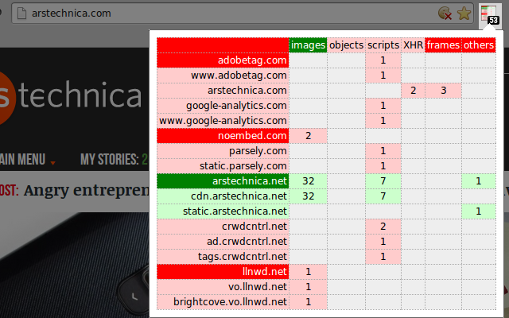

#Script HQ

A Chromium browser extension which let you white- or black-list requests
originating from within a web page according to their type and/or destination
as per domain name.

Available on Chrome web store (<a href="https://chrome.google.com/webstore/detail/scripthq/mghdpehejfekicfjcdbfofhcmnjhgaag">ScriptHQ</a>),
or you can copy the content of this github to:

{chromium folder on your machine}/Default/Extensions/mghdpehejfekicfjcdbfofhcmnjhgaag

This is a very early draft, but it does the job. I intend to keep working on
it until I am satisfied that it can be tagged as version 1.0.

##License

<a href="https://github.com/gorhill/scripthq/blob/master/LICENSE.txt">GPLv3</a>.
